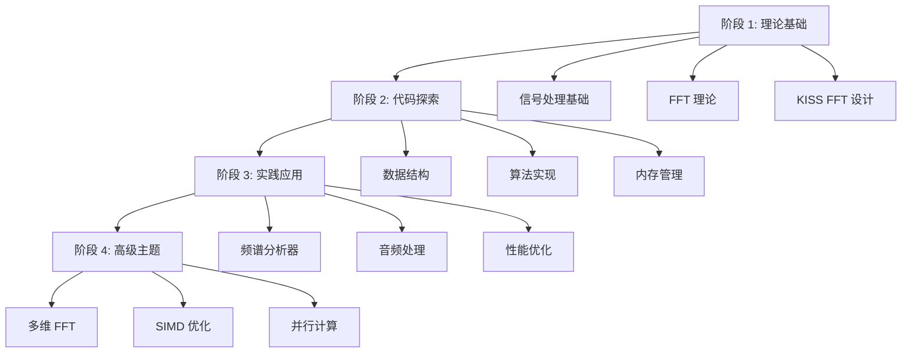

# KISS FFT 学习计划总览

这是一个全面的学习计划，帮助您从零开始掌握 KISS FFT 和数字信号处理。

## 快速开始

### 预备知识
- C 语言编程基础
- 基本的数学知识（复数、三角函数）
- 了解命令行操作

### 开发环境
```bash
# 克隆 KISS FFT 项目
git clone https://github.com/mborgerding/kissfft.git
cd kissfft

# 编译项目
mkdir build && cd build
cmake ..
make

# 运行测试
make test
```

## 学习路径



## 详细学习计划

### 阶段 1：FFT 理论基础（1-2 周）

**目标**：建立扎实的理论基础

**关键主题**：
- 数字信号处理基础
- 傅里叶变换理论
- FFT 算法原理
- KISS FFT 设计哲学

**实践任务**：
- 实现 DFT 算法
- 分析不同信号的频谱
- 理解 FFT 的时间复杂度

**交付物**：
- [ ] 理论笔记
- [ ] DFT 实现代码
- [ ] 信号分析报告

### 阶段 2：核心代码探索（2-3 周）

**目标**：深入理解 KISS FFT 实现

**关键主题**：
- 核心数据结构
- FFT 算法实现
- 内存管理策略
- 不同数据类型处理

**实践任务**：
- 阅读和分析源代码
- 实现代码跟踪工具
- 性能分析实验

**交付物**：
- [ ] 代码分析报告
- [ ] 性能基准测试
- [ ] 优化建议文档

### 阶段 3：实践应用（2 周）

**目标**：将理论转化为实际应用

**关键主题**：
- 实时频谱分析
- 音频处理应用
- 性能优化技巧
- 项目集成

**实践任务**：
- 开发频谱分析器
- 实现音频均衡器
- 优化性能瓶颈

**交付物**：
- [ ] 可运行的应用程序
- [ ] 性能测试报告
- [ ] 用户文档

### 阶段 4：高级主题（1-2 周）

**目标**：探索进阶技术和优化

**关键主题**：
- 多维 FFT
- SIMD 优化
- 并行计算
- 工具集成

**实践任务**：
- 实现 2D FFT
- SIMD 优化实验
- OpenMP 并行化

**交付物**：
- [ ] 高级实现代码
- [ ] 性能对比报告
- [ ] 扩展方案

## 学习资源

### 必读材料
1. **KISS FFT 文档**
   - README.md - 项目概述
   - TIPS - 性能优化指南
   - 头文件注释

2. **推荐书籍**
   - 《数字信号处理》- Oppenheim
   - 《快速傅里叶变换及其应用》- Brigham

### 编程工具
- 编译器：GCC/Clang/MSVC
- 调试器：GDB/Visual Studio Debugger
- 性能分析：gprof/perf/VTune

### 在线资源
- [Understanding the FFT](https://jackschaedler.github.io/circles-sines-signals/)
- [DSP Guide](http://www.dspguide.com/)

## 实践项目

### 项目 1：音频频谱分析器
```c
// 主要功能
- 实时音频捕获
- FFT 频谱计算
- 可视化显示
- 交互控制

// 技术要点
- PortAudio 音频 I/O
- 实时 FFT 处理
- 窗函数应用
- 延迟优化
```

### 项目 2：图像滤波器
```c
// 主要功能
- 2D FFT 实现
- 频域滤波
- 图像增强
- 实时处理

// 技术要点
- 多维 FFT
- 内存布局优化
- 滤波器设计
- 边界处理
```

### 项目 3：性能优化器
```c
// 主要功能
- SIMD 检测和优化
- 并行计算
- 性能基准测试
- 自动优化选择

// 技术要点
- CPU 特性检测
- 向量化编程
- 多线程同步
- 动态优化
```

## 评估标准

### 知识掌握（40%）
- 理论理解深度
- 算法原理掌握
- 数学基础扎实

### 编程能力（40%）
- 代码质量
- 实现正确性
- 性能优化

### 实践应用（20%）
- 项目完成度
- 创新性
- 文档完整性

## 学习建议

### 时间安排
- **总时长**：6-9 周
- **每周投入**：10-15 小时
- **理论学习**：40%
- **编程实践**：60%

### 学习方法
1. **循序渐进**：不要跳过阶段
2. **动手实践**：理论结合代码
3. **记录笔记**：总结重要概念
4. **寻求反馈**：与社区交流

### 常见陷阱
- ❌ 跳过理论基础直接看代码
- ❌ 只看不练，缺乏实践
- ❌ 追求完美，拖延进度
- ❌ 孤立学习，缺乏交流

### 成功要素
- ✅ 建立扎实的理论基础
- ✅ 持续的代码实践
- ✅ 主动探索和实验
- ✅ 定期总结和反思

## 进阶方向

完成基础学习后，可以探索：

### 算法方向
- 其他 FFT 算法（Winograd, Split-Radix）
- 小波变换
- 自适应滤波

### 应用方向
- 音频编码（MP3, AAC）
- 图像压缩（JPEG）
- 通信系统（OFDM）

### 优化方向
- GPU 加速（CUDA, OpenCL）
- FPGA 实现
- 专用硬件设计

## 社区资源

### 开源项目
- [FFTW](http://www.fftw.org/) - 最快的 FFT 库
- [Accelerate](https://developer.apple.com/documentation/accelerate) - Apple 的优化库
- [Intel MKL](https://software.intel.com/en-us/mkl) - Intel 数学库

### 论坛和社区
- DSP Stack Exchange
- GitHub Issues
- Reddit r/DSP

### 会议和活动
- ICASSP - 信号处理国际会议
- AES - 音频工程学会
- 本地技术聚会

## 总结

KISS FFT 作为一个"Keep It Simple, Stupid"的项目，是学习 FFT 算法的绝佳选择。通过这个系统的学习计划，您将：

1. **掌握核心理论**：深入理解 FFT 的数学原理
2. **提升编程技能**：学会优化和扩展算法实现
3. **获得实践经验**：完成实际应用项目
4. **准备进阶学习**：为深入研究打下基础

记住，学习是一个持续的过程。完成这个计划后，您将具备：
- 分析和实现信号处理算法的能力
- 优化性能的经验
- 解决实际问题的技能

祝您学习愉快！🚀

---

最后更新：2024年12月
版本：1.0